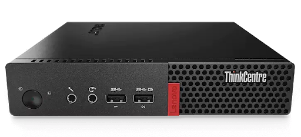
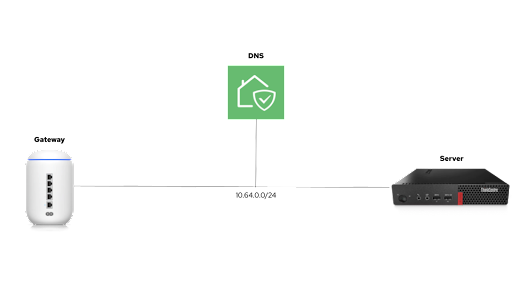
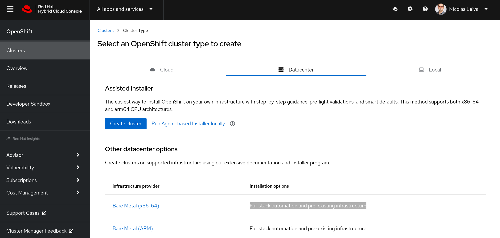
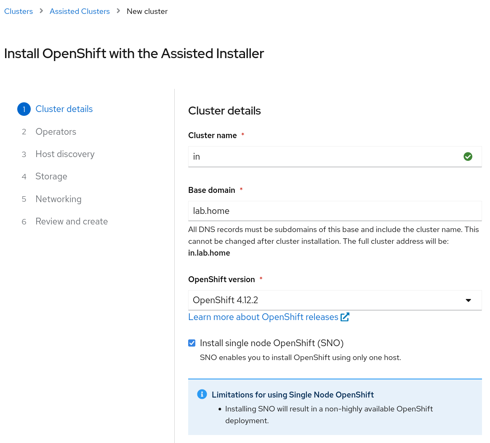
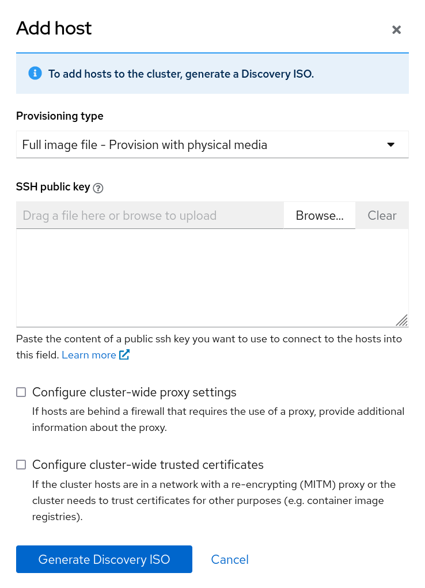
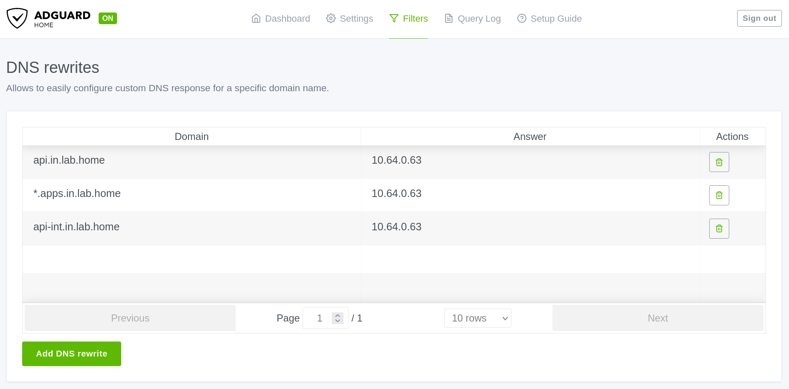

I wanted to run OpenShift on the smallest form factor I could. This is what worked for me.

My understanding is that there are at least three OpenShift flavors to cover different on-prem use cases. These are the hardware requirements for each one.

| | Cores | RAM | Storage |
|----------|----------|----------|----------|
| [OpenShift](https://docs.openshift.com/container-platform/4.12/installing/installing_sno/install-sno-preparing-to-install-sno.html) | 8 vCPU | 16 GB | 120 GB |
| [OpenShift Local](https://access.redhat.com/documentation/en-us/red_hat_openshift_local/2.13/html/getting_started_guide/installation_gsg#minimum-system-requirements_gsg) | 4 physical CPU | 9 GB | 35 GB |
| [MicroShift](https://access.redhat.com/documentation/en-us/red_hat_build_of_microshift/4.12/html-single/installing/index#system-requirements-installing-microshift) | 2 CPU | 2 GB | 10 GB |

## Hardware

I didn’t want to miss any OpenShift features, so I needed a machine with 8 vCPU or in other words a server with a 4-core processor (8 threads) to run OpenShift on a single node (SNO).

I found on Amazon a [renewed M910 Tiny](https://smile.amazon.com/dp/B08MMQH98H) with an [Intel® Core™ i7-6700T](https://www.intel.com/content/www/us/en/products/sku/88200/intel-core-i76700t-processor-8m-cache-up-to-3-60-ghz/specifications.html) processor that meets the requirements for about 280 dollars.

   
  <b>ThinkCentre M910 tiny desktop</b> 

## Creating an OpenShift cluster

I have installed [Kubernetes the Hard Way](https://github.com/nleiva/kubernetes-the-hard-way) many times now, so I was prepared to follow lengthy instructions. Fortunately, OpenShift has streamlined this process. Aside from a couple of caveats I cover here, the process goes smoothly providing a much better user experience.

My [home lab](https://github.com/nleiva/ansible-home#hw-details) has a Ubiquiti gateway to connect to the Internet and I use [AdGuard Home](https://github.com/AdguardTeam/AdguardHome#readme) for DNS.

   
  <b>Home lab topology</b> 

To kick start the process, you have to go to https://console.redhat.com/openshift/create and select Datacenter > Bare Metal > Interactive (installation method). If you don’t have a Red Hat account, you can create one for free and run an OpenShift trial.

   
  <b>Assisted installer</b> 

Next, you name your cluster and select SNO for a single node OpenShift (SNO).

   
  <b>Naming the cluster</b> 

I named the cluster **in** and use **lab.home** for the base domain.

The next section on the interactive installer (*Operators*) lets you add **OpenShift Virtualization** and **Logical Volume Manager Storage** to the cluster. Do not select any of these options if you only have 8 vCPUs like me: *OpenShift Virtualization* needs another 6 vCPUs and *Logical Volume Manager Storage* one more vCPU.

The next step is to generate an ISO file to boot any node you’d like to add to the cluster. In this example we only have one node:

   
  <b>Generate a discovery ISO</b> 

Click on *Generate Discovery ISO* and off you go. The file size is approximately 1.1 GB.  

Before we boot this ISO on the server, we need to add a couple of DNS entries as noted in the [Requirements for installing OpenShift on a single node](https://docs.openshift.com/container-platform/4.12/installing/installing_sno/install-sno-preparing-to-install-sno.html#install-sno-requirements-for-installing-on-a-single-node_install-sno-preparing).

| Usage | FQDN |
|----------|----------|
| Kubernetes API | api.<cluster_name>.<base_domain> |
| Ingress route | *.apps.<cluster_name>.<base_domain> |
| Internal API | api-int.<cluster_name>.<base_domain> |

This translates to the following in this example, where `10.64.0.63` is the IP address I statically allocate via DHCP to the server.

   
  <b>DNS entries</b> 

With DNS out of the way, I can now run the generated ISO on the server.

## Booting the ISO

You need a USB stick that the server can boot from. I use [Fedora Media Writer](https://github.com/FedoraQt/MediaWriter#fedora-media-writer) to make a USB stick bootable with an ISO file.

To tell the server to boot from the USB stick, you need to press **F12** after you power it on to get to the boot menu. Then select USB and let it run.

   
  <b>Boot menu</b> 

