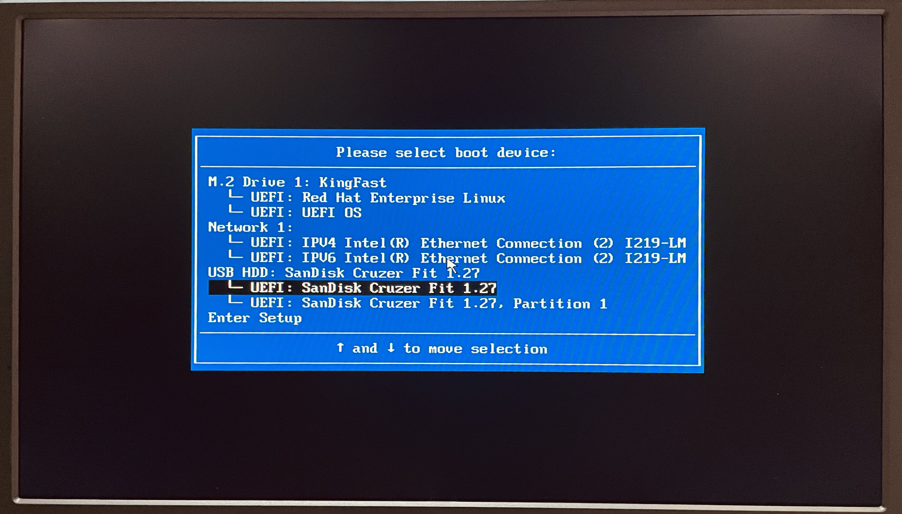
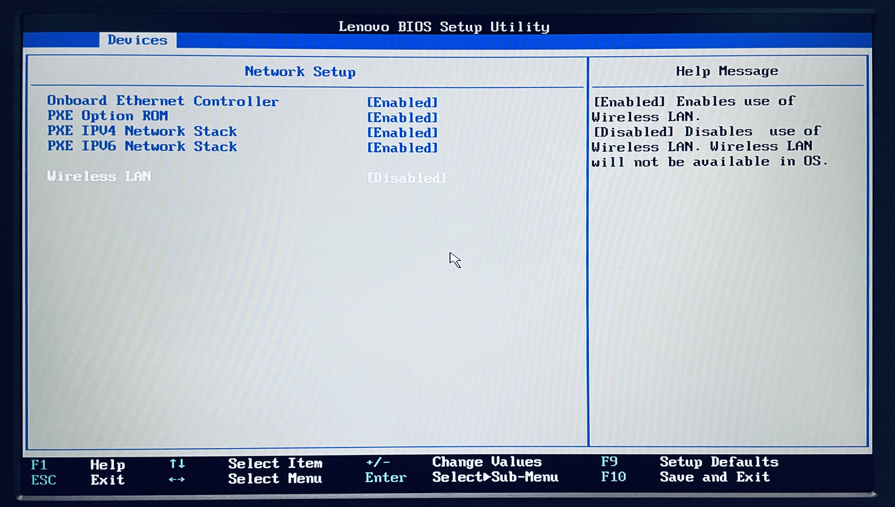
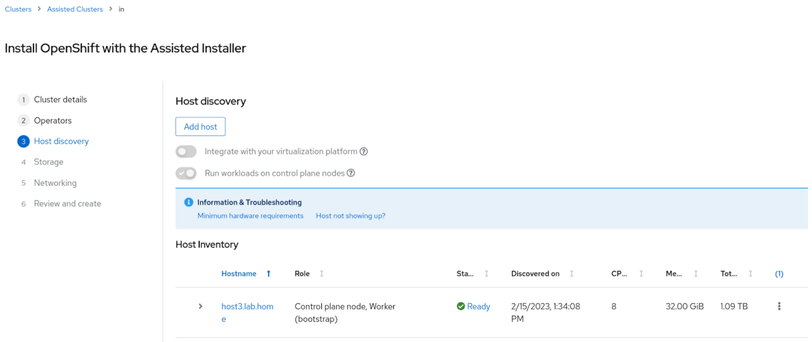
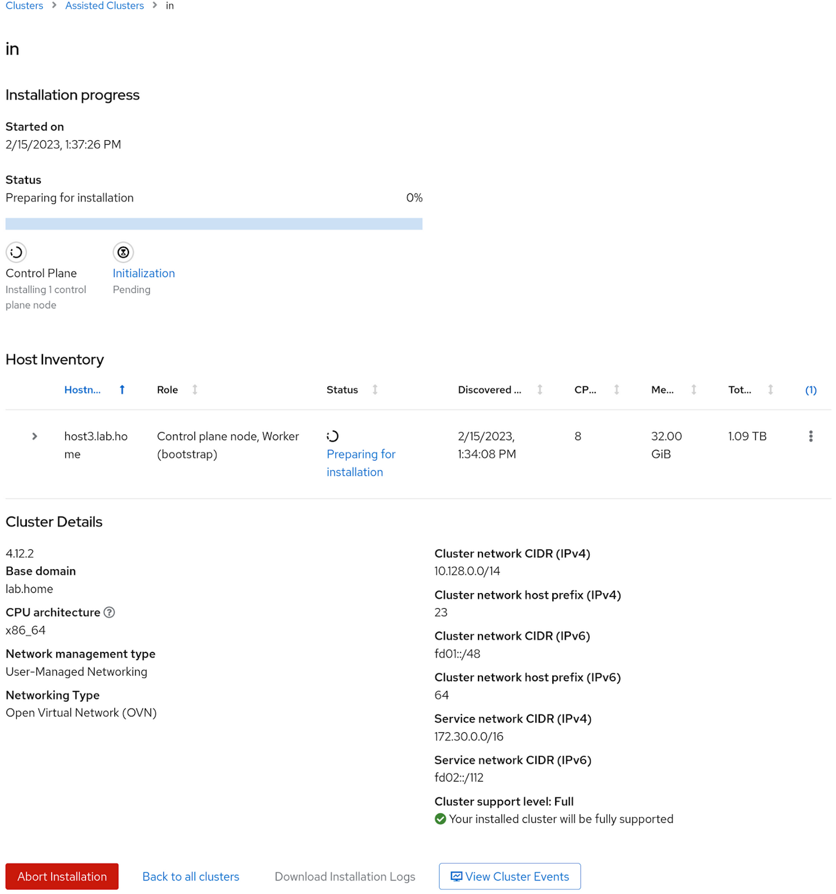
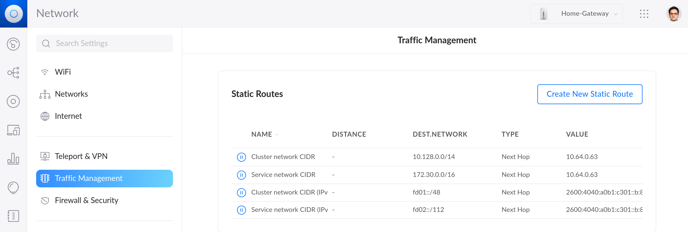
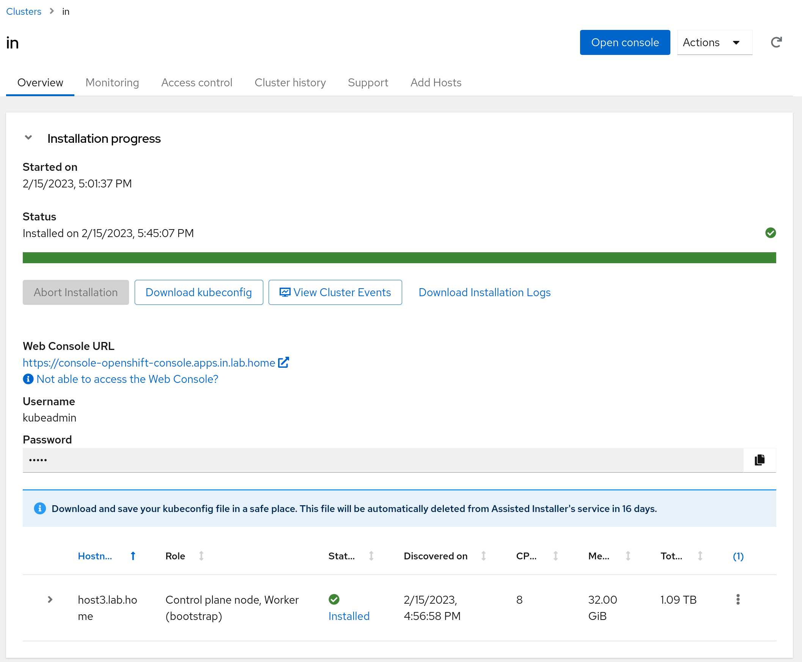

# My 300-dollar OpenShift cluster

I wanted to run OpenShift on the smallest form factor I could. This is what worked for me.

My understanding is that there are at least three OpenShift flavors to cover different on-prem use cases. These are the hardware requirements for each one.

| | Cores | RAM | Storage |
|----------|----------|----------|----------|
| [OpenShift](https://docs.openshift.com/container-platform/4.12/installing/installing_sno/install-sno-preparing-to-install-sno.html) | 8 vCPU | 16 GB | 120 GB |
| [OpenShift Local](https://access.redhat.com/documentation/en-us/red_hat_openshift_local/2.13/html/getting_started_guide/installation_gsg#minimum-system-requirements_gsg) | 4 physical CPU | 9 GB | 35 GB |
| [MicroShift](https://access.redhat.com/documentation/en-us/red_hat_build_of_microshift/4.12/html-single/installing/index#system-requirements-installing-microshift) | 2 CPU | 2 GB | 10 GB |

## Hardware

I didn’t want to miss any OpenShift features, so I needed a machine with 8 vCPU or in other words a server with a 4-core processor (8 threads) to run OpenShift on a single node (SNO).

I found on Amazon a [renewed M910 Tiny](https://smile.amazon.com/dp/B08MMQH98H) with an [Intel® Core™ i7-6700T](https://www.intel.com/content/www/us/en/products/sku/88200/intel-core-i76700t-processor-8m-cache-up-to-3-60-ghz/specifications.html) processor that meets the requirements for about 280 dollars.

<p align="center">
  <br>
  <b>ThinkCentre M910 tiny desktop</b><br>
</p>

## Creating an OpenShift cluster

I have installed [Kubernetes the Hard Way](https://github.com/nleiva/kubernetes-the-hard-way) many times now, so I was prepared to follow lengthy instructions. Fortunately, OpenShift has streamlined this process. Aside from a couple of caveats I cover here, the process goes smoothly providing a much better user experience.

My [home lab](https://github.com/nleiva/ansible-home#hw-details) has a Ubiquiti gateway to connect to the Internet and I use [AdGuard Home](https://github.com/AdguardTeam/AdguardHome#readme) for DNS.

<p align="center">
  <br>
  <b>Home lab topology</b><br>
</p>

To kick start the process, you have to go to https://console.redhat.com/openshift/create and select Datacenter > Bare Metal > Interactive (installation method). If you don’t have a Red Hat account, you can create one for free and run an OpenShift trial.

<p align="center">
  <br>
  <b>Assisted installer</b><br>
</p>

Next, you name your cluster and select SNO for a single node OpenShift (SNO).

<p align="center">
  <br>
  <b>Naming the cluster</b><br>
</p>

I named the cluster **in** and use **lab.home** for the base domain.

The next section on the interactive installer (*Operators*) lets you add **OpenShift Virtualization** and **Logical Volume Manager Storage** to the cluster. Do not select any of these options if you only have 8 vCPUs like me: *OpenShift Virtualization* needs another 6 vCPUs and *Logical Volume Manager Storage* one more vCPU.

The next step is to generate an ISO file to boot any node you’d like to add to the cluster. In this example we only have one node:

<p align="center">
  <br>
  <b>Generate a discovery ISO</b><br>
</p>

Click on *Generate Discovery ISO* and off you go. The file size is approximately 1.1 GB.  

Before we boot this ISO on the server, we need to add a couple of DNS entries as noted in the [Requirements for installing OpenShift on a single node](https://docs.openshift.com/container-platform/4.12/installing/installing_sno/install-sno-preparing-to-install-sno.html#install-sno-requirements-for-installing-on-a-single-node_install-sno-preparing).

| Usage | FQDN |
|----------|----------|
| Kubernetes API | api.<cluster_name>.<base_domain> |
| Ingress route | *.apps.<cluster_name>.<base_domain> |
| Internal API | api-int.<cluster_name>.<base_domain> |

This translates to the following in this example, where `10.64.0.63` is the IP address I statically allocate via DHCP to the server.

<p align="center">
  <br>
  <b>DNS entries</b><br>
</p>

With DNS out of the way, I can now run the generated ISO on the server.

## Booting the ISO

You need a USB stick that the server can boot from. I use [Fedora Media Writer](https://github.com/FedoraQt/MediaWriter#fedora-media-writer) to make a USB stick bootable with an ISO file.

To tell the server to boot from the USB stick, you need to press **F12** after you power it on to get to the boot menu. Then select USB and let it run.

<p align="center">
  <br>
  <b>Boot menu</b><br>
</p>

However, this server in particular has WiFi, which we need to disable to avoid kernel panics. So, in the boot menu, I selected **Enter Setup** first. In **Network Setup** changed **Wireless LAN** to *Disabled*.

<p align="center">
  <br>
  <b>BIOS Network setup</b><br>
</p>

After that, you can safely boot from the USB stick. The host will eventually show up as ready to install in the assisted installer interface:

<p align="center">
  <br>
  <b>Host discovered</b><br>
</p>

Before you proceed with the installation, you can select the IP address allocation for the cluster's internal networks. I went with the defaults (`10.128.0.0/14`, `172.30.0.0/16`) and I selected dual-stack support to leverage IPv6 (`fd01::/48`, `fd02::/112`).

<p align="center">
  <br>
  <b>Installing software on node</b><br>
</p>

After this, the installer goes ahead and takes care of all the rest. You no longer need to look at the server screen.

If hosts in your home network want to access any of the services you deploy in OpenShift, they will need to know how to reach the cluster internal networks the installer just configured (`10.128.0.0/14`, `172.30.0.0/16`, `fd01::/48`, and `fd02::/112`). There are ways to do this dynamically, but for this example, I can simply create static routes in the Gateway pointing to the server:

<p align="center">
  <br>
  <b>Configuring routing</b><br>
</p>

## Installing the OpenShift CLI

We can check if everything is working from your computer with the [OpenShift CLI](https://docs.openshift.com/container-platform/4.12/cli_reference/openshift_cli/getting-started-cli.html#installing-openshift-cli). You can download this utility from the OpenShift console. 

But first, from the cluster view, download your **kubeconfig** by clicking on the *Download kubeconfig* button and also copy the password to access the console (user `kubeadmin`).

<p align="center">
  <br>
  <b>Cluster view</b><br>
</p>

Then click on the ‘Open Console’ button or go to the URL *https://console-openshift-console.apps.<cluster_name>.<base_domain>*, which in this example is: *https://console-openshift-console.apps.in.lab.home/*.  

From the web console, click on **?** to see the link to **Command line tools** or go to *https://console-openshift-console.apps.<cluster_name>.<base_domain>/command-line-tools*.

After you download the binary for your computer's operating system, move it to a location on your computer's PATH, so you can run it from anywhere. In this example I did the following:

```bash
$ mv ~/Downloads/oc-4.12.2-linux/* ~/bin
```

To authenticate with the Kubernetes API you need to move your **kubeconfig** to `~/.kube/config`.

```bash
$ mv ~/Downloads/kubeconfig ~/.kube/config
```

## Enjoy OpenShift

If you got here, you should be able to contact the cluster from your computer.

```bash
$ oc cluster-info
Kubernetes control plane is running at https://api.in.lab.home:6443
```

You can check the status of the node with `oc get nodes`.

```bash
$ oc get nodes
NAME         	STATUS   ROLES                     	AGE	VERSION
host3.lab.home   Ready	control-plane,master,worker   152m   v1.25.4+a34b9e9
```

For more commands, check the [CLI reference](https://docs.openshift.com/container-platform/4.12/cli_reference/openshift_cli/developer-cli-commands.html).

## Conclusions
The installation process has come a long way, making it suitable for even a $300-dollar server. 

In the next post, I’ll show how to scale the Ansible Automation Platform with OpenShift.

Thanks to Chris Keller and Juan Jose Floristan for their support in setting up my single-node cluster. I would still be banging my head against the wall if it wasn’t for them.
