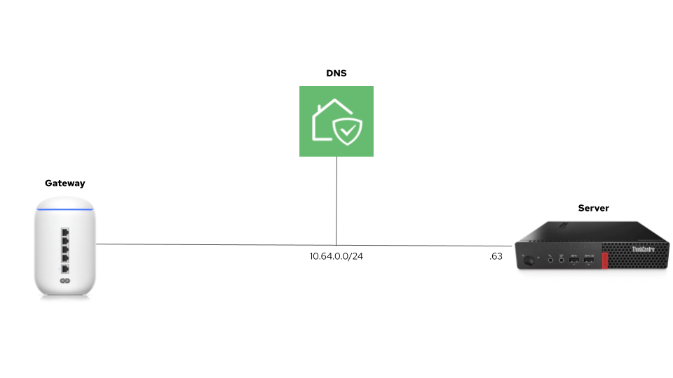

I wanted to run OpenShift on the smallest form factor I could. This is what worked for me.

My understanding is that there are at least three OpenShift flavors to cover different on-prem use cases. These are the hardware requirements for each one.

| | Cores | RAM | Storage |
|----------|----------|----------|----------|
| [OpenShift](https://docs.openshift.com/container-platform/4.12/installing/installing_sno/install-sno-preparing-to-install-sno.html) | 8 vCPU | 16 GB | 120 GB |
| [OpenShift Local](https://access.redhat.com/documentation/en-us/red_hat_openshift_local/2.13/html/getting_started_guide/installation_gsg#minimum-system-requirements_gsg) | 4 physical CPU | 9 GB | 35 GB |
| [MicroShift](https://access.redhat.com/documentation/en-us/red_hat_build_of_microshift/4.12/html-single/installing/index#system-requirements-installing-microshift) | 2 CPU | 2 GB | 10 GB |

## Hardware

I didn’t want to miss any OpenShift features, so I needed a machine with 8 vCPU or in other words a server with a 4-core processor (8 threads) to run OpenShift on a single node (SNO).

I found on Amazon a [renewed M910 Tiny](https://smile.amazon.com/dp/B08MMQH98H) with an [Intel® Core™ i7-6700T](https://www.intel.com/content/www/us/en/products/sku/88200/intel-core-i76700t-processor-8m-cache-up-to-3-60-ghz/specifications.html) processor that meets the requirements for about 280 dollars.

   
  <b>ThinkCentre M910 tiny desktop</b> 

## Creating an OpenShift cluster

I have installed [Kubernetes the Hard Way](https://github.com/nleiva/kubernetes-the-hard-way) many times now, so I was prepared to follow lengthy instructions. Fortunately, OpenShift has streamlined this process. Aside from a couple of caveats I cover here, the process goes smoothly providing a much better user experience.

My [home lab](https://github.com/nleiva/ansible-home#hw-details) has a Ubiquiti gateway to connect to the Internet and I use [AdGuard Home](https://github.com/AdguardTeam/AdguardHome#readme) for DNS.

   
  <b>Home lab topology</b> 

To kick start the process, you have to go to https://console.redhat.com/openshift/create and select Datacenter > Bare Metal > Interactive (installation method). If you don’t have a Red Hat account, you can create one for free and run an OpenShift trial.

   
  <b>Assisted installer</b> 

Next, you name your cluster and select SNO for a single node OpenShift (SNO).